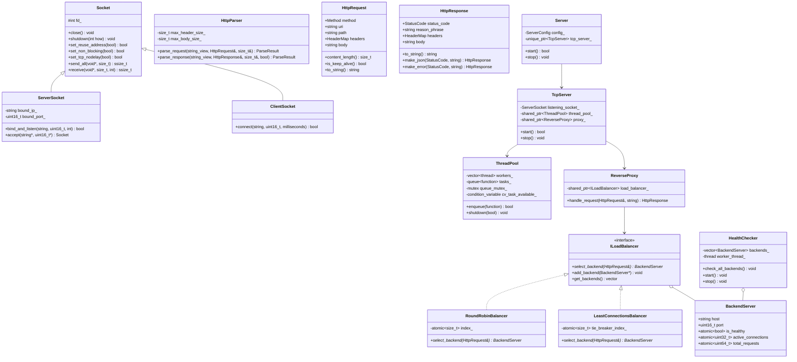

# Object-Oriented Class Diagram

```mermaid
classDiagram
    class Socket {
        #int fd_
        +close() void
        +shutdown(int how) void
        +set_reuse_address(bool) bool
        +set_non_blocking(bool) bool
        +set_tcp_nodelay(bool) bool
        +send_all(void*, size_t) ssize_t
        +receive(void*, size_t, int) ssize_t
    }

    class ServerSocket {
        -string bound_ip_
        -uint16_t bound_port_
        +bind_and_listen(string, uint16_t, int) bool
        +accept(string*, uint16_t*) Socket
    }

    class ClientSocket {
        +connect(string, uint16_t, milliseconds) bool
    }

    Socket <|-- ServerSocket
    Socket <|-- ClientSocket

    class HttpParser {
        -size_t max_header_size_
        -size_t max_body_size_
        +parse_request(string_view, HttpRequest&, size_t&) ParseResult
        +parse_response(string_view, HttpResponse&, size_t&, bool) ParseResult
    }

    class HttpRequest {
        +Method method
        +string uri
        +string path
        +HeaderMap headers
        +string body
        +content_length() size_t
        +is_keep_alive() bool
        +to_string() string
    }

    class HttpResponse {
        +StatusCode status_code
        +string reason_phrase
        +HeaderMap headers
        +string body
        +to_string() string
        +make_json(StatusCode, string) HttpResponse
        +make_error(StatusCode, string) HttpResponse
    }

    class ThreadPool {
        -vector~thread~ workers_
        -queue~function~ tasks_
        -mutex queue_mutex_
        -condition_variable cv_task_available_
        +enqueue(function) bool
        +shutdown(bool) void
    }

    class ILoadBalancer {
        <<interface>>
        +select_backend(HttpRequest&) BackendServer*
        +add_backend(BackendServer*) void
        +get_backends() vector
    }

    class RoundRobinBalancer {
        -atomic~size_t~ index_
        +select_backend(HttpRequest&) BackendServer*
    }

    class LeastConnectionsBalancer {
        -atomic~size_t~ tie_breaker_index_
        +select_backend(HttpRequest&) BackendServer*
    }

    ILoadBalancer <|.. RoundRobinBalancer
    ILoadBalancer <|.. LeastConnectionsBalancer

    class BackendServer {
        +string host
        +uint16_t port
        +atomic~bool~ is_healthy
        +atomic~uint32_t~ active_connections
        +atomic~uint64_t~ total_requests
    }

    class ReverseProxy {
        -shared_ptr~ILoadBalancer~ load_balancer_
        +handle_request(HttpRequest&, string) HttpResponse
    }

    class HealthChecker {
        -vector~BackendServer~ backends_
        -thread worker_thread_
        +check_all_backends() void
        +start() void
        +stop() void
    }

    class TcpServer {
        -ServerSocket listening_socket_
        -shared_ptr~ThreadPool~ thread_pool_
        -shared_ptr~ReverseProxy~ proxy_
        +start() bool
        +stop() void
    }

    class Server {
        -ServerConfig config_
        -unique_ptr~TcpServer~ tcp_server_
        +start() bool
        +stop() void
    }

    Server --> TcpServer
    TcpServer --> ThreadPool
    TcpServer --> ReverseProxy
    ReverseProxy --> ILoadBalancer
    ILoadBalancer o-- BackendServer
    HealthChecker o-- BackendServer
```
